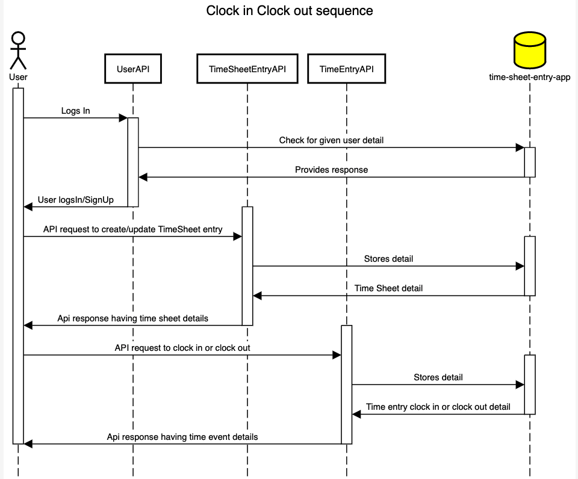
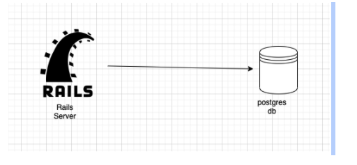

Time clock will help you in clock in and clock out your time. It keeps a time sheet entry where it specifies each day clock in clock out time and total time spent
Access the app here in Heroku: https://serene-headland-71302.herokuapp.com/login

*Design Process:*
*Requirement gathering Phase:*

*Requirements for Users:*
User should be able to sign up
User should be able to log in 
User can be normal user or an admin
Only admin can view all users timesheet entries
Only admin can change the settings
Any user should be able to create or update timesheet entry (limited to few fields)
User should be able to clock in and clock out
Only admin can change 

*Requirements for clock in clock out:*
User should see whether to clock in or clock out
They can clock in and clock out multiple times in a day
User should be able to see start time and end time
User should be able to see time spent for the day
User should be able to see the history of events

*Finding out entities:*

Entities involved here
*User entity*
*Timesheet entity:* Entity which will have the high-level detail of employee name, email id and history of clock in clock out
*Time Entry entity:* Entity that will allow users to clock in and clock out for the given time.

*Relationships:*
A user can have only one time sheet entry
A timesheet entry belongs to one user
A timesheet entry will have many clocks in and clocks out entries

*Sequence Diagram:*

*High-Level Design:*

*2. Schema design and other alternatives*

Database Engine used:

*Postgres*

Other Alternatives: 

*MongoDb* will be the great choice when we are scaling for many users.
When users grow we need not to think about joining multiple tables. 
In one fetch we can get every details.
It depends on use case as well.

*Schema Design* is simple.
A user table having user name, password, email
A time sheet entry to see time sheet details of the user and it can have other details like user last login and log out time or aggregated result. This table can be considered as a dimension table
A time entry event table will have all events that the user has done so far. It will be considered as a fact table

*TODO:*

Things to do optimising queries and checking if it can handle huge volume of data by setting up load testing. Also settingup monitoring, profiling and deploying via cicd pipeline using kube
